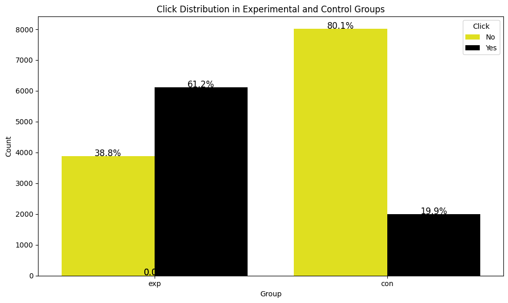
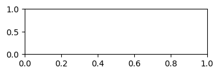
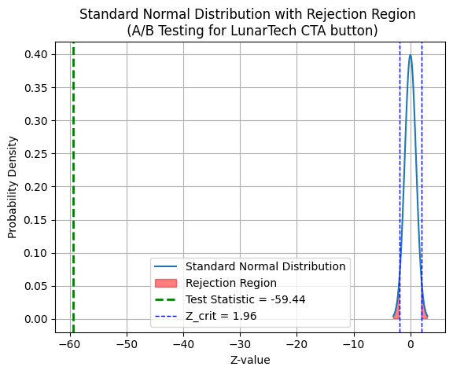

```python
#Import libraries
import numpy as np
import pandas as pd
import matplotlib.pyplot as plt
import seaborn as sns
import scipy.stats as stats
```


```python
#Get data from local
from google.colab import files
uploaded = files.upload()
```


     <input type="file" id="files-2e68dcae-d51e-45ed-ad0b-fa02be6b4bb9" name="files[]" multiple disabled
        style="border:none" />
     <output id="result-2e68dcae-d51e-45ed-ad0b-fa02be6b4bb9">
      Upload widget is only available when the cell has been executed in the
      current browser session. Please rerun this cell to enable.
      </output>
      <script>// Copyright 2017 Google LLC
//
// Licensed under the Apache License, Version 2.0 (the "License");
// you may not use this file except in compliance with the License.
// You may obtain a copy of the License at
//
//      http://www.apache.org/licenses/LICENSE-2.0
//
// Unless required by applicable law or agreed to in writing, software
// distributed under the License is distributed on an "AS IS" BASIS,
// WITHOUT WARRANTIES OR CONDITIONS OF ANY KIND, either express or implied.
// See the License for the specific language governing permissions and
// limitations under the License.

/**
 * @fileoverview Helpers for google.colab Python module.
 */
(function(scope) {
function span(text, styleAttributes = {}) {
  const element = document.createElement('span');
  element.textContent = text;
  for (const key of Object.keys(styleAttributes)) {
    element.style[key] = styleAttributes[key];
  }
  return element;
}

// Max number of bytes which will be uploaded at a time.
const MAX_PAYLOAD_SIZE = 100 * 1024;

function _uploadFiles(inputId, outputId) {
  const steps = uploadFilesStep(inputId, outputId);
  const outputElement = document.getElementById(outputId);
  // Cache steps on the outputElement to make it available for the next call
  // to uploadFilesContinue from Python.
  outputElement.steps = steps;

  return _uploadFilesContinue(outputId);
}

// This is roughly an async generator (not supported in the browser yet),
// where there are multiple asynchronous steps and the Python side is going
// to poll for completion of each step.
// This uses a Promise to block the python side on completion of each step,
// then passes the result of the previous step as the input to the next step.
function _uploadFilesContinue(outputId) {
  const outputElement = document.getElementById(outputId);
  const steps = outputElement.steps;

  const next = steps.next(outputElement.lastPromiseValue);
  return Promise.resolve(next.value.promise).then((value) => {
    // Cache the last promise value to make it available to the next
    // step of the generator.
    outputElement.lastPromiseValue = value;
    return next.value.response;
  });
}

/**
 * Generator function which is called between each async step of the upload
 * process.
 * @param {string} inputId Element ID of the input file picker element.
 * @param {string} outputId Element ID of the output display.
 * @return {!Iterable<!Object>} Iterable of next steps.
 */
function* uploadFilesStep(inputId, outputId) {
  const inputElement = document.getElementById(inputId);
  inputElement.disabled = false;

  const outputElement = document.getElementById(outputId);
  outputElement.innerHTML = '';

  const pickedPromise = new Promise((resolve) => {
    inputElement.addEventListener('change', (e) => {
      resolve(e.target.files);
    });
  });

  const cancel = document.createElement('button');
  inputElement.parentElement.appendChild(cancel);
  cancel.textContent = 'Cancel upload';
  const cancelPromise = new Promise((resolve) => {
    cancel.onclick = () => {
      resolve(null);
    };
  });

  // Wait for the user to pick the files.
  const files = yield {
    promise: Promise.race([pickedPromise, cancelPromise]),
    response: {
      action: 'starting',
    }
  };

  cancel.remove();

  // Disable the input element since further picks are not allowed.
  inputElement.disabled = true;

  if (!files) {
    return {
      response: {
        action: 'complete',
      }
    };
  }

  for (const file of files) {
    const li = document.createElement('li');
    li.append(span(file.name, {fontWeight: 'bold'}));
    li.append(span(
        `(${file.type || 'n/a'}) - ${file.size} bytes, ` +
        `last modified: ${
            file.lastModifiedDate ? file.lastModifiedDate.toLocaleDateString() :
                                    'n/a'} - `));
    const percent = span('0% done');
    li.appendChild(percent);

    outputElement.appendChild(li);

    const fileDataPromise = new Promise((resolve) => {
      const reader = new FileReader();
      reader.onload = (e) => {
        resolve(e.target.result);
      };
      reader.readAsArrayBuffer(file);
    });
    // Wait for the data to be ready.
    let fileData = yield {
      promise: fileDataPromise,
      response: {
        action: 'continue',
      }
    };

    // Use a chunked sending to avoid message size limits. See b/62115660.
    let position = 0;
    do {
      const length = Math.min(fileData.byteLength - position, MAX_PAYLOAD_SIZE);
      const chunk = new Uint8Array(fileData, position, length);
      position += length;

      const base64 = btoa(String.fromCharCode.apply(null, chunk));
      yield {
        response: {
          action: 'append',
          file: file.name,
          data: base64,
        },
      };

      let percentDone = fileData.byteLength === 0 ?
          100 :
          Math.round((position / fileData.byteLength) * 100);
      percent.textContent = `${percentDone}% done`;

    } while (position < fileData.byteLength);
  }

  // All done.
  yield {
    response: {
      action: 'complete',
    }
  };
}

scope.google = scope.google || {};
scope.google.colab = scope.google.colab || {};
scope.google.colab._files = {
  _uploadFiles,
  _uploadFilesContinue,
};
})(self);
</script> 


    Saving ab_test_click_data (1).csv to ab_test_click_data (1).csv
    


```python
#Loading Click Through Rate Data for AB Test
df = pd.read_csv('ab_test_click_data (1).csv')
```


```python
#Display the first few rows
print(df.head())
print(df.describe())
print(df.groupby('group').sum('click'))
```

       user_id  click group            timestamp
    0        1      1   exp  2024-01-01 00:00:00
    1        2      0   exp  2024-01-01 00:01:00
    2        3      1   exp  2024-01-01 00:02:00
    3        4      0   exp  2024-01-01 00:03:00
    4        5      1   exp  2024-01-01 00:04:00
                user_id         click
    count  20000.000000  20000.000000
    mean   10000.500000      0.405250
    std     5773.647028      0.490953
    min        1.000000      0.000000
    25%     5000.750000      0.000000
    50%    10000.500000      0.000000
    75%    15000.250000      1.000000
    max    20000.000000      1.000000
             user_id  click
    group                  
    con    150005000   1989
    exp     50005000   6116
    

A simple bar chart showing the total clicks versus no-clicks in each group can provide a clear visual comparison of user engagement.


```python
#Custom palette for yellow and black
palette = {0: 'yellow', 1:'black'}

#Plotting the click distribution for each group can provide a clear visual comparison of user engagement
plt.figure(figsize=(10,6))
ax =sns.countplot(x='group', hue='click', data=df, palette=palette)
plt.title('Click Distribution in Experimental and Control Groups')
plt.xlabel('Group')
plt.ylabel('Count')
plt.legend(title='Click', labels=['No', 'Yes'])


#Calculate the percentages and annotate the bars
group_counts = df.groupby(['group']).size()
group_click_counts = df.groupby(['group', 'click']).size().reset_index(name='count')

for p in ax.patches:
  height = p.get_height()
  #Find the group and click type for the current bar
  group = 'exp' if p.get_x() < 0.5 else 'con'
  click = 1 if p.get_x() % 1 > 0.5 else 0
  total = group_counts.loc[group]
  percentage = 100 * height / total
  ax.text(p.get_x() + p.get_width() / 2., height + 5, f'{percentage:.1f}%', ha='center', color='black', fontsize='12')

plt.tight_layout()
plt.show()
```


    

    


β:Probability of Type II Error

(1-β):Power of the test

α:Probability of Type I Error, Significance

δ:Minimum Detectable Effect


```python
alpha = 0.05 # 5%
print('Alpha: significance level is:', alpha)

delta = 0.1 # 10%
print('Delta: minimum detectable effect is', delta)

```

    Alpha: significance level is: 0.05
    Delta: minimum detectable effect is 0.1
    

Calculating total number of clicks per group by summing clicks


```python
N_con = df[df['group'] == 'con'].count()
N_exp = df[df['group'] == 'exp'].count()


# calculating the total number of clicks per group by summing 1's
X_con = df.groupby('group')['click'].sum().loc['con']
X_exp = df.groupby('group')['click'].sum().loc['exp']

# printing this for visibility
print(df.groupby('group')['click'].sum())
print('Number of users in Control: ', N_con)
print('Number of users in Experimental: ', N_exp)
print('Number of Clicks in Control: ', X_con)
print('Number of Clicks in Experimental: ', X_exp)
```

    group
    con    1989
    exp    6116
    Name: click, dtype: int64
    Number of users in Control:  user_id      10000
    click        10000
    group        10000
    timestamp        0
    dtype: int64
    Number of users in Experimental:  user_id      10000
    click        10000
    group        10000
    timestamp    10000
    dtype: int64
    Number of Clicks in Control:  1989
    Number of Clicks in Experimental:  6116
    

Calculating Poolde Estimates for Clicks per Group


```python
# computing the estimate of click probability per group
p_con_hat = X_con / N_con
p_con_hat = p_con_hat.iloc[0]
p_exp_hat = X_exp / N_exp
p_exp_hat = p_exp_hat.iloc[0]
print('Click probability in Control Group: ', p_con_hat)
print('Click probability in Experimental Group: ', p_exp_hat)

# computing the estimate of pooled clicked probability
p_pooled_hat = (X_con + X_exp) / (N_con + N_exp)
print('Pooled click probability: ', p_pooled_hat)
```

    Click probability in Control Group:  0.1989
    Click probability in Experimental Group:  0.6116
    Pooled click probability:  user_id      0.40525
    click        0.40525
    group        0.40525
    timestamp    0.81050
    dtype: float64
    


    

    


Calculating Pooled Variance


```python
# computing the estimate of pooled variance
pooled_variance = p_pooled_hat * (1-p_pooled_hat) * (1/N_con + 1/N_exp)
print('p^ pooled is', p_pooled_hat)
print('Pooled variance is: ', pooled_variance)

```

    p^ pooled is user_id      0.40525
    click        0.40525
    group        0.40525
    timestamp    0.81050
    dtype: float64
    Pooled variance is:  user_id      0.000048
    click        0.000048
    group        0.000048
    timestamp         inf
    dtype: float64
    

Calculating Standard Error and Test statistics


```python
#computing the standard error of the test
SE = np.sqrt(pooled_variance)
SE = SE.iloc[0]
print("Standard Error is: ", SE)

#computing the test statistics of the Z-test
Test_stat = (p_con_hat - p_exp_hat)/SE

print("Test statistics for Z-sample Z-test is:", Test_stat)

#critical value of the Z-test
Z_crit = stats.norm.ppf(1-alpha/2)
print("Z-critical value from Standard Normal distribution: ", Z_crit)
```

    Standard Error is:  0.006942945160376826
    Test statistics for Z-sample Z-test is: -59.44163326469381
    Z-critical value from Standard Normal distribution:  1.959963984540054
    

**Calculating p_values of the Z-test**

. A low p-value (p <= 0.05 at 5% significance level) indicates strong evidence against the null hypothesis, so we reject the null hypothesis

. A high p_value (p>0.05) indicates weak evidence against the null hypothesis, so we fail to reject the null hypothesis.


```python
#calculating p-value
p_value = 2 * stats.norm.sf(abs(Test_stat))


# function checking the statistical significance
def is_statistical_significance(p_value, alpha):
  """
  We assess whether there is statistical significance based on the p-value and alpha

  Arguments:
  - p_value (float): The p-value resulting from a statistical test.
  - alpha (float, optional): The significance level threshold used to determine statistical significance. Defaults to 0.05.

  Returns:
  - Prints the assessment of statistical significance.
  """
  #Print the rounded p-value to 3 decimal places
  print(f"p-value of the 2-sample Z-test: {round(p_value, 3)}")

  # Determine statistical significance
  if p_value <= alpha:
    print("There is statistical significance, indicating that the observed differences between the groups are unlikely to have occured due to random chance. This suggests the new version of the landing page results in a higher CTR")

  else:
    print("There is no statistical significance, indicating that the observed differences between the groups are likely to have occured due to random chance. This suggests the new version of the landing page results in a lower CTR")

is_statistical_significance(p_value, alpha)
```

    p-value of the 2-sample Z-test: 0.0
    There is statistical significance, indicating that the observed differences between the groups are unlikely to have occured due to random chance. This suggests the new version of the landing page results in a higher CTR
    


```python
#Parameters for the standard normal distribution
mu = 0 #Mean
sigma = 1 #Standard deviation
x = np.linspace(mu - 3*sigma, mu + 3*sigma, 100)
y = stats.norm.pdf(x, mu, sigma)


#Plotting the standard normal distribution
plt.plot(x,y, label='Standard Normal Distribution')
# Shade the rejection region for a two tailed test
plt.fill_between(x, y, where=(x > Z_crit) | (x < -Z_crit), color='red', alpha=0.5, label='Rejection Region')
# Adding Test statistic
plt.axvline(x=Test_stat, color='green', linestyle='dashed', linewidth=2, label=f'Test Statistic = {Test_stat:.2f}')
# Adding Z-critical values
plt.axvline(-Z_crit, color='blue', linestyle='dashed', linewidth=1, label=f'Z_crit = {Z_crit:.2f}')
plt.axvline(Z_crit, color='blue', linestyle='dashed', linewidth=1)

# Adding labels and title
plt.xlabel('Z-value')
plt.ylabel('Probability Density')
plt.title('Standard Normal Distribution with Rejection Region \n (A/B Testing for LunarTech CTA button)')
plt.legend()
plt.grid(True)
plt.show()

```


    

    


Calculating Confidence Interval of the Test


```python
# Calculate the Confidence Interval (CI) for a 2-sample Z-test
## Calculate the lower and upper bounds of the confidence interval

CI_95 = [
    round((p_exp_hat - p_con_hat) - SE*Z_crit, 3), # Lower bound of the CI, rounded to 3 decimal places
    round((p_exp_hat - p_con_hat) + SE*Z_crit, 3)  # Upper bound of the CI rounded to 3 decimal places
]
# Print the calculated confidence interval
print("Confidence Interval of the 2 sample Z-test is:", CI_95)

# Here, the confidence interval provides a range of values within which the true difference between the experimental and control group
```

    Confidence Interval of the 2 sample Z-test is: [np.float64(0.399), np.float64(0.426)]
    

Testing for Practical Significance in A/B Testing


```python
def is_Practically_significant(delta, CI_95):
  """
  We assess here if the difference between the experimental and control group is practically significant using the Minimum Detectable Effect (MDE)

  Arguments:
  - delta (float): The Minimum Detectable Effect (MDE) considered for prectical significance
  - CI_95 (tuple): A tuple representing the lower and upper bounds of the 95% confidence interval.

  Returns:
  - Prints whether the experiment has practical significance using the MDE and CI
  """

  # Extract lower bound of 95% Confidence Interval
  lower_bound_CI = CI_95[0]

  # Check if the lower bound of the CI is greater than or equal to delta
  if lower_bound_CI >= delta:
    print(f"We have practical significance! \nWith MDE of {delta}, The difference between Control and Experimental group is practically significanct.")
    return True
  else:
    print("We don't have practical significance! \nThe difference between Control and Experimental group is not practically significant")
    return False

# Call the function
significance = is_Practically_significant(delta, CI_95)
print("Lower bound of 95% confidence interval is: ", CI_95[0])
```

    We have practical significance! 
    With MDE of 0.1, The difference between Control and Experimental group is practically significanct.
    Lower bound of 95% confidence interval is:  0.399
    

We conclude that the ENROLL NOW button statistically leads to higher click through rate.

Based on this research we should replace the RESUME FREE TRIAL button with the new ENROLL NOW button.
